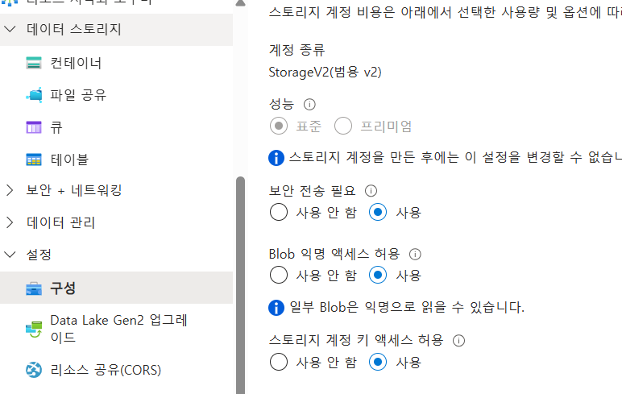
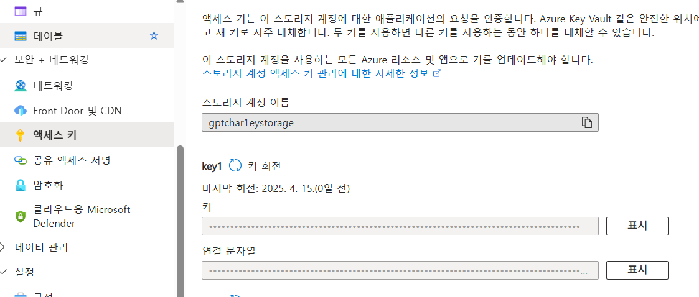
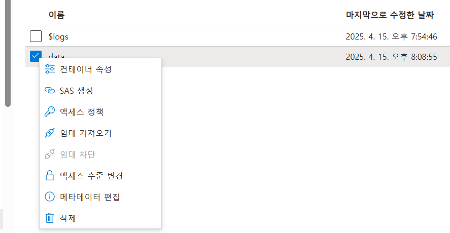

# Blob Storage

## 컨테이너

폴더 개념

1. 생성 후 txt 파일 테스트로 업로드

```xml
<Error>
<script/>
<Code>PublicAccessNotPermitted</Code>
<Message>Public access is not permitted on this storage account. RequestId:835f98b6-501e-009b-22f5-ad4a62000000 Time:2025-04-15T11:02:41.1200186Z</Message>
</Error>
```

2. Public Access가 막혀있으므로 풀어준다.



-   프라이빗으로 할 경우 요청 헤더에 키를 넣어 접근하도록 설정도 가능



3. 다시 접근

에러가 발생 --> 엑세스 레벨 문제 --> 스토리지 단위는 허용했으나, 컨테이너 허용을 해주지 않음

```xml
<Error>
<script/>
<Code>ResourceNotFound</Code>
<Message>The specified resource does not exist. RequestId:41738ad0-301e-0024-7bf6-ad7dc7000000 Time:2025-04-15T11:07:25.8394324Z</Message>
</Error>
```

4. 컨테이너 허용



5. 정상 접근 확인 완료
